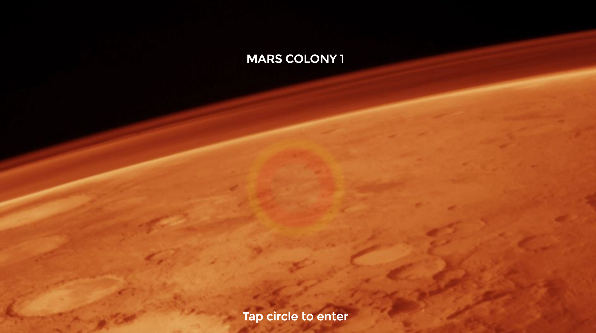

# Mars Colony App

- Created a web-based application for Earth colonists exploring Mars using Angular 2.

- Implemented GET and POST HTTP requests using Angular’s HTTP service

- Created aesthetically-relevant styles to build out a “Mars” theme for the app

- Implemented the Angular 2 Router

- Implemented ngForm and validate user input, and prevent forms from sending invalid API requests

- Implemented the following Angular built-in directives: ngFor, ngIf, ngClass, and ngModel

- Implement the OnInit Class interface

